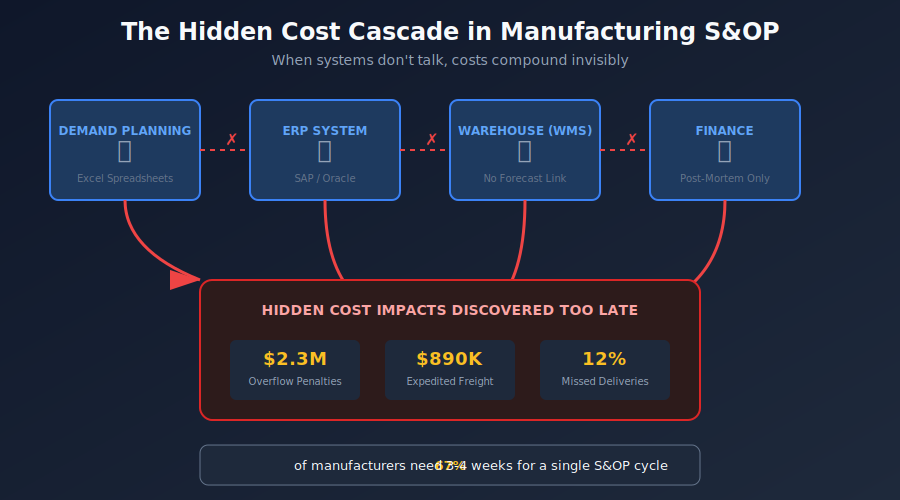
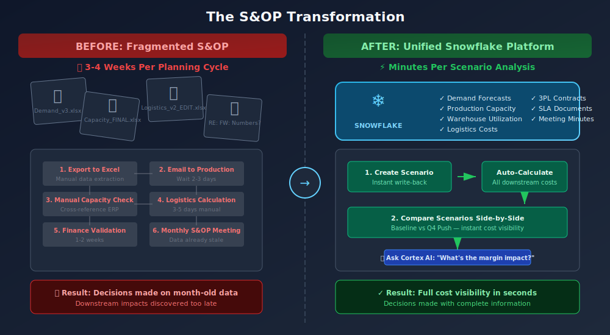
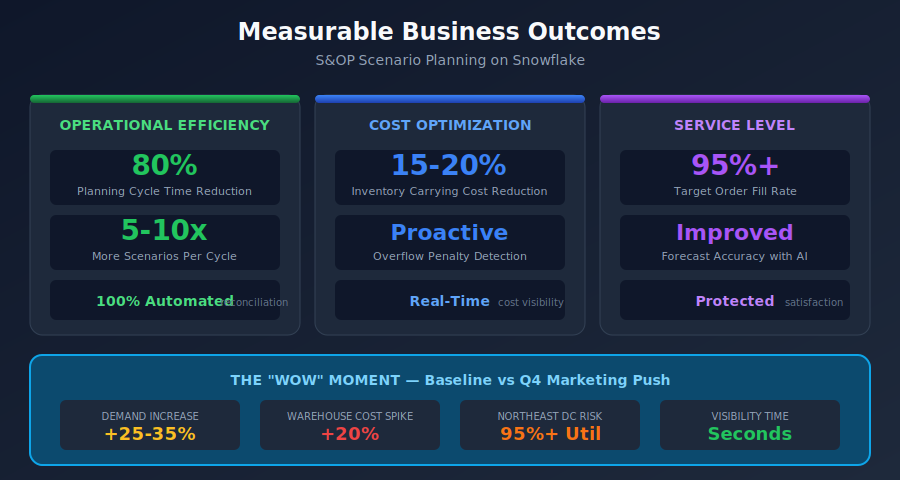

# S&OP Integrated Scenario Planning & Logistics Optimization

**A Snowflake Solution for Manufacturing**

---

## Executive Summary

Manufacturing organizations lose billions annually to poor Sales & Operations Planning (S&OP) alignment. When Marketing pushes an aggressive Q4 campaign, the downstream impact on production capacity, warehouse utilization, and logistics costs often remains invisible until it's too late—resulting in expedited freight charges, warehouse overflow penalties, and missed customer shipments.

This solution demonstrates how Snowflake's unified data platform transforms S&OP from a monthly spreadsheet exercise into **real-time, AI-powered scenario planning**—enabling manufacturing leaders to see the full cost impact of demand changes in seconds, not weeks.

---

## 1. The Cost of Inaction

### Real-World Impact

In Q4 2023, a mid-sized consumer electronics manufacturer launched an aggressive holiday marketing campaign projecting 30% higher demand. The demand plan was approved in the monthly S&OP meeting, but the downstream logistics impact wasn't calculated until three weeks later—when the warehouse team discovered they needed 40% more storage capacity than contracted.

**The result:**
- **$2.3M** in overflow storage penalties at 3PL facilities
- **$890K** in expedited freight to redistribute inventory
- **12%** of orders missed delivery windows, triggering customer penalties
- **8-point drop** in customer satisfaction scores

This isn't an isolated incident. According to industry research:

> **"67% of manufacturers report that their S&OP process takes 3-4 weeks to complete a single planning cycle, leaving them unable to respond to demand changes in time."**
> — APICS Supply Chain Council

> **"Companies with fragmented planning systems experience 15-25% higher inventory carrying costs and 20% more stockouts compared to those with integrated platforms."**
> — Gartner Supply Chain Research

### The Hidden Cost Cascade

When demand planning, production scheduling, and logistics costing operate in silos, cost impacts compound invisibly:



| Stage | What Happens | Hidden Cost |
|-------|-------------|-------------|
| **Demand** | Marketing submits 30% uplift in spreadsheet | None visible yet |
| **Production** | Capacity team plans Q3 pre-build in separate system | Overtime not flagged |
| **Warehouse** | Inventory builds but utilization not tracked | Approaching overflow |
| **Logistics** | Overflow discovered 3 weeks before peak | Emergency storage at 3x rate |
| **Finance** | Margin erosion discovered in post-mortem | Too late to adjust |

---

## 2. The Problem in Context

### Why Traditional S&OP Falls Short

Manufacturing organizations face a fundamental misalignment between the **speed of business decisions** and the **speed of planning visibility**:

#### Pain Point 1: Siloed Data, Fragmented Truth

- Demand forecasts live in Excel spreadsheets or legacy planning tools
- Production capacity sits in ERP (SAP, Oracle, Infor)
- Warehouse utilization tracked in WMS with no forecast integration
- Logistics costs buried in 3PL invoices and contract PDFs
- **Result:** No single source of truth for scenario impact analysis

#### Pain Point 2: Planning Cycles Measured in Weeks

- Monthly S&OP meetings operate on stale data (2-4 weeks old)
- "What-if" analysis requires manual spreadsheet manipulation
- By the time Finance validates cost impact, the business has moved on
- **Result:** Decisions made without full cost visibility

#### Pain Point 3: Hidden Logistics Costs

- Warehouse overflow penalties buried in contract fine print
- Storage cost per pallet varies by zone, season, and utilization
- 3PL SLAs contain tiered penalty structures few planners understand
- **Result:** True cost of demand decisions invisible until invoice arrives

#### Pain Point 4: No Demand-to-Capacity Causality

- Can't trace a 25% demand increase to specific warehouse overflow
- Production pre-build strategy disconnected from storage capacity
- Scenario comparison requires days of manual reconciliation
- **Result:** Reactive firefighting instead of proactive planning

### The Manufacturing Persona Perspective

| Persona | Current Pain | What They Need |
|---------|-------------|----------------|
| **VP of Supply Chain** | "I approve demand plans without seeing the full logistics cost. Then Finance tells me we blew the warehousing budget 6 weeks later." | Instant scenario comparison showing revenue vs. total cost of carry |
| **Demand Planner** | "I can't create a 'what-if' scenario without copying 15 spreadsheets and hoping I don't break formulas." | Version-controlled scenario creation with automatic downstream calculation |
| **Logistics Analyst** | "I know we'll overflow the Northeast DC, but I can't prove it until it happens." | Capacity utilization projection based on incoming demand scenarios |
| **Plant Manager** | "They keep asking for more Q3 pre-build but won't tell me if we have space to store it." | Production schedule aligned with warehouse capacity constraints |

---

## 3. The Transformation

### Before: Monthly S&OP with Disconnected Systems



**The Old Way:**
1. Demand Planner exports forecast from planning tool to Excel
2. Emails spreadsheet to Production for capacity check (2-3 days)
3. Production sends modified version back with constraints
4. Logistics manually calculates storage needs (3-5 days)
5. Finance validates margin impact (1-2 weeks)
6. S&OP meeting reviews month-old data
7. Decision made; downstream impact discovered later

**Cycle Time:** 3-4 weeks per planning iteration

### After: Real-Time Scenario Planning on Snowflake

**The New Way:**
1. Demand Planner creates "Q4 Marketing Push" scenario in Streamlit app
2. Scenario instantly calculates:
   - Production pre-build requirements
   - Warehouse capacity utilization by zone
   - Logistics cost including overflow penalties
   - Net margin after all costs
3. VP of Supply Chain toggles between Baseline and Q4 Push
4. **The "Wow" Moment:** Dashboard shows 20% warehouse cost spike in seconds
5. Team asks Cortex AI: "What's the margin impact of the increased storage costs?"
6. Decision made with full visibility; plan approved or adjusted

**Cycle Time:** Minutes, not weeks

### The Transformation in Numbers

| Metric | Before | After | Improvement |
|--------|--------|-------|-------------|
| Planning Cycle Time | 3-4 weeks | Minutes | **~99% faster** |
| Scenario Iterations per Cycle | 1-2 | 10+ | **5-10x more** |
| Cost Visibility Lag | 6+ weeks | Real-time | **Eliminated** |
| Manual Data Reconciliation | 20+ hours/cycle | 0 | **100% automated** |
| Planning Systems Accessed | 4-6 | 1 | **Unified** |

---

## 4. What We'll Achieve

### Measurable Outcomes

This solution delivers quantifiable business value across three dimensions:



#### Operational Efficiency

| KPI | Target Outcome | How It's Achieved |
|-----|---------------|-------------------|
| **Planning Cycle Time** | 80% reduction | Real-time scenario calculation replaces manual iteration |
| **Scenario Throughput** | 5-10x increase | Instant what-if analysis enables rapid exploration |
| **Data Reconciliation** | Eliminated | Single source of truth across demand, production, logistics |

#### Cost Optimization

| KPI | Target Outcome | How It's Achieved |
|-----|---------------|-------------------|
| **Inventory Carrying Cost** | 15-20% reduction | Optimized pre-build strategy balances production and storage |
| **Overflow Penalty Avoidance** | Proactive detection | Capacity utilization alerts before breach |
| **Expedited Freight** | Significant reduction | Earlier visibility enables planned logistics |

#### Service Level Improvement

| KPI | Target Outcome | How It's Achieved |
|-----|---------------|-------------------|
| **Order Fill Rate** | 95%+ target | Demand-capacity alignment ensures inventory availability |
| **Forecast Accuracy** | Improved | AI-powered demand sensing and scenario validation |
| **Customer Satisfaction** | Protected | On-time delivery through proactive planning |

### The "Wow" Moment Quantified

In the demo scenario, toggling from **Baseline** to **Q4 Marketing Push** reveals:

- **+25-35%** demand increase in Q4 months
- **+20%** warehousing cost spike (Northeast DC at risk of overflow)
- **-X%** net margin impact when storage costs are included
- **Immediate visibility** into which warehouse zones exceed capacity

This instant calculation—previously requiring 2-3 weeks of manual analysis—demonstrates the core value proposition: **See the full cost of demand decisions before you commit.**

---

## 5. Why Snowflake for Manufacturing S&OP

### The Four Pillars

#### Pillar 1: Unified Supply Chain Data Platform

**Manufacturing Challenge:** Demand lives in planning tools, capacity in ERP, costs in spreadsheets. No single view.

**Snowflake Solution:**
- Ingest demand forecasts, production capacity, warehouse inventory, and logistics costs into one platform
- Type 2 SCD (Slowly Changing Dimensions) for full history and auditability
- Real-time views that join across domains without ETL delays

**Result:** One query answers "What's the margin impact of Q4 Push including logistics costs?"

#### Pillar 2: Real-Time Scenario Versioning with Hybrid Tables

**Manufacturing Challenge:** Creating a "what-if" scenario means copying spreadsheets and breaking formulas.

**Snowflake Solution:**
- **Hybrid Tables** enable low-latency write-back from Streamlit
- Scenario versioning with automatic timestamp and lineage
- Non-destructive: Create "Q4 Push V2" without touching Baseline

**Result:** Demand Planner creates new scenario; downstream costs calculate instantly.

#### Pillar 3: AI-Powered Insights with Cortex

**Manufacturing Challenge:** Answering "What's the penalty if we exceed 90% warehouse capacity?" requires finding contract PDFs.

**Snowflake Solution:**
- **Cortex Analyst:** Natural language to SQL for structured data queries
- **Cortex Search:** RAG over 3PL contracts, warehouse SLAs, S&OP meeting minutes
- Combined: "Show me the margin impact of Q4 Push" returns SQL-generated answer; "What are the overflow penalties in the Northeast contract?" returns RAG-sourced answer

**Result:** VP asks business question; AI routes to structured or unstructured data as appropriate.

#### Pillar 4: Governed Collaboration with Version Control

**Manufacturing Challenge:** "Which version of the demand plan did we approve? Who changed it?"

**Snowflake Solution:**
- Every scenario change tracked with timestamp and user
- Role-based access: Planners can create scenarios; only Managers can set Official Baseline
- Full audit trail for compliance and post-mortem analysis

**Result:** "We approved Q4 Push V3 on September 15th with projected 18% warehouse cost increase."

---

## 6. How It Comes Together

### Solution Architecture

The solution follows a **left-to-right data flow** from manufacturing sources through Snowflake layers to business outcomes:

```
Manufacturing     Snowflake          AI/Analytics      Business
   Sources    →    Layers       →      Layer       →   Outcomes
```

See [SOP_Architecture.md](SOP_Architecture.md) for detailed technical architecture.

### The User Journey

#### Step 1: Demand Planner Creates Scenario

1. Opens **Scenario Builder** page in Streamlit
2. Selects "Q4 Marketing Push" as base
3. Applies +30% adjustment to Electronics category for October-December
4. Clicks "Save Scenario" → Writes to Snowflake Hybrid Table
5. System automatically calculates downstream impacts

#### Step 2: VP of Supply Chain Compares Scenarios

1. Opens **Executive Dashboard**
2. Selects scenarios: "Baseline" and "Q4 Marketing Push"
3. Dashboard displays side-by-side:
   - Revenue comparison by month
   - Warehouse cost comparison (immediate red flag on Northeast DC)
   - Net margin after logistics costs
4. **The "Wow" Moment:** Sees 20% warehouse cost spike in seconds

#### Step 3: Logistics Analyst Validates Capacity

1. Opens **Capacity Analysis** page
2. Views warehouse utilization by zone
3. Northeast DC shows 95%+ utilization in October under Q4 Push
4. ML optimization suggests production smoothing across Q3 to avoid overflow

#### Step 4: Team Asks AI for Clarification

1. Opens **AI Analyst** panel
2. Asks: "What's the penalty if we exceed capacity at the Northeast DC?"
3. Cortex Search retrieves relevant 3PL contract clause
4. Asks: "What's the margin impact of Q4 Push compared to Baseline?"
5. Cortex Analyst generates SQL and returns comparison

#### Step 5: Decision and Approval

1. VP decides: Accept Q4 Push with additional warehouse budget allocation
2. Or: Modify Q4 Push to smooth demand across months
3. Scenario marked as "Approved" with timestamp and approver
4. Finance has real-time visibility into committed plan

### Application Pages

| Page | Persona | Purpose |
|------|---------|---------|
| **Executive Dashboard** | VP Supply Chain | Scenario comparison, KPI variance, "wow" moment |
| **Scenario Builder** | Demand Planner | Create/modify scenarios with write-back |
| **Capacity Analysis** | Logistics Analyst | Production and warehouse capacity deep-dive |
| **AI Analyst** | All Users | Natural language queries (structured + unstructured) |
| **About** | All Users | Documentation and getting started |

---

## Call to Action

### For Manufacturing Leaders

This solution demonstrates what's possible when S&OP planning moves from fragmented spreadsheets to a unified, AI-powered platform. The key question isn't whether to modernize—it's how fast you can close the visibility gap before the next demand spike catches you off guard.

**Next Steps:**

1. **See the Demo:** Walk through the "Wow" moment—Baseline vs. Q4 Push scenario comparison with instant logistics cost visibility
2. **Map Your Data:** Identify your demand, production, and logistics data sources for integration assessment
3. **Quantify the Gap:** Calculate your current planning cycle time and hidden cost discovery lag

### Ready to Transform Your S&OP Process?

Contact your Snowflake account team to discuss how this solution pattern can be adapted for your manufacturing organization's specific data landscape, planning processes, and business objectives.

---

## Appendix: Data Model Reference

### Core Tables

| Table | Purpose | Key Fields |
|-------|---------|------------|
| `DEMAND_FORECAST` | Forecast quantities by product/site/scenario | `SCENARIO_ID`, `PRODUCT_ID`, `SITE_ID`, `FORECAST_QUANTITY` |
| `SCENARIO_DEFINITION` | Scenario metadata | `SCENARIO_CODE`, `IS_OFFICIAL_BASELINE`, `CREATED_BY` |
| `SITE` | Warehouse and plant master data | `SITE_TYPE`, `REGION`, `CAPACITY_UNITS` |
| `PRODUCT` | Product master with category hierarchy | `PRODUCT_FAMILY`, `UNIT_COST`, `UNIT_REVENUE` |
| `LOGISTICS_COST` | Storage and overflow cost parameters | `STORAGE_COST_PER_PALLET`, `OVERFLOW_PENALTY_RATE` |

### Key Metrics (from Semantic Model)

| Metric | Description |
|--------|-------------|
| `total_forecasted_revenue` | Sum of revenue across forecast lines |
| `total_warehousing_cost` | Sum of projected storage costs |
| `net_margin_after_warehousing` | Gross margin minus logistics costs |
| `gross_margin_percentage` | Margin as percentage of revenue |

---

*This document is part of the S&OP Solution Package. See also: [Architecture](SOP_Architecture.md) | [Blog](SOP_Blog.md) | [Slides](SOP_Slides.md) | [Video Script](SOP_Video_Script.md)*

